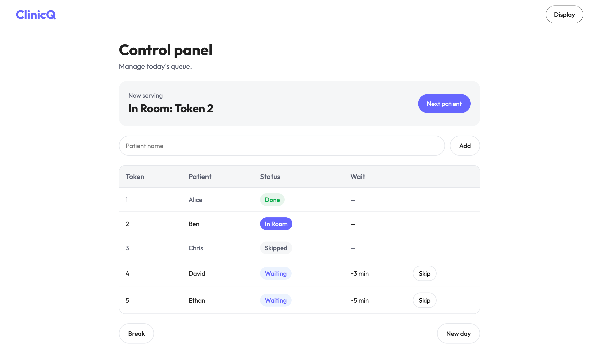
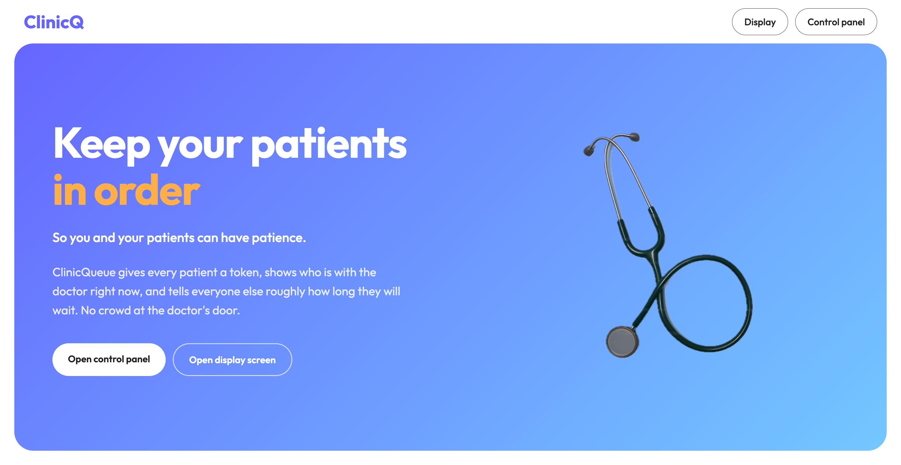
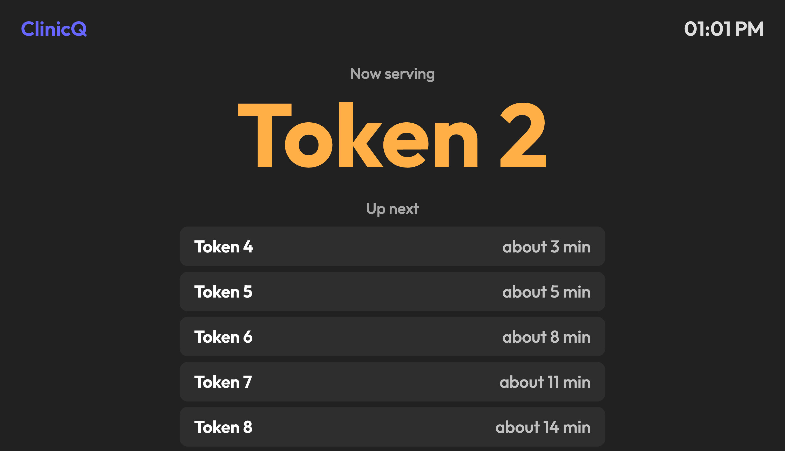

# ClinicQueue

A token and queue system for small clinics. The receptionist adds patients, the doctor calls the next one with a single button, and a screen in the waiting room shows who is inside and roughly how long everyone else will wait.

**Live demo:** https://abdulmanaan.github.io/clinicqueue/



## The problem

Most small clinics run their line on a paper register. Patients don't know when their turn will come, keep asking the receptionist, and crowd outside the doctor's door.

## What it does

- Adds a patient and gives them the next token number automatically
- Calls the next patient with one button and marks the previous one as done
- Skips patients who don't show up, without holding up the line
- Estimates each patient's waiting time from how long recent checkups actually took
- Break / Resume for doctors who sit in two shifts; the line keeps its place and patients can still be added
- Waiting room display that updates on its own, with a large token number and a clock. It shows tokens only, never patient names
- Keeps the queue after a page refresh
- "New day" clears the queue and starts tokens from 1 again
- Works on phones, laptops and TVs

## Screenshots

| Home | Control panel | Display |
| --- | --- | --- |
|  |  |  |

## Built with

Plain HTML, CSS and JavaScript. No frameworks or libraries.

- `localStorage` saves the queue in the browser
- The `storage` event lets the display screen redraw itself whenever the control panel changes the queue

## Run it locally

```bash
git clone https://github.com/abdulmanaan/clinicqueue.git
cd clinicqueue
```

Open the folder in VS Code and start `index.html` with the Live Server extension. Open the control panel and the display in two windows side by side, then add a patient and press "Next patient".

## Project structure

```
index.html          Home page
controlpanel.html   Receptionist and doctor controls
display.html        Waiting room screen
script.js           Control panel logic
display.js          Display logic and clock
common.js           Waiting time calculation shared by both pages
style.css           Styles for all pages
```

## Limitations

- The control panel and the display must run in the same browser on the same computer, because the data lives in that browser
- One clinic, one doctor

---